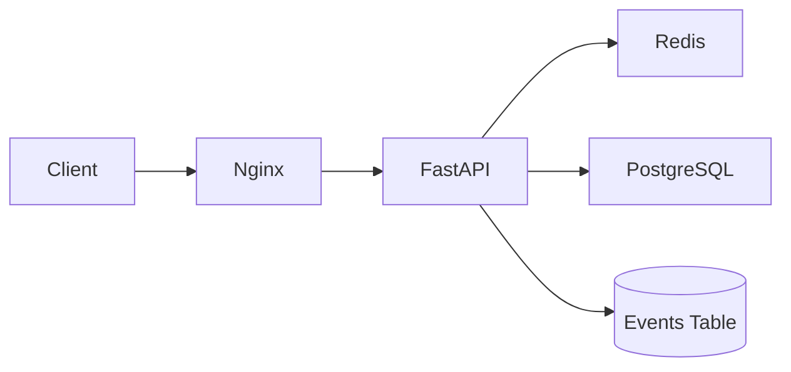

# URL Shortener Production Engineering Docs
Production engineering reference for the FastAPI + PostgreSQL + Redis + Nginx hackathon implementation.

```
 _   _ ____  _      ____  _   _  ___  ____ _____ _____ _   _ _____ ____
| | | |  _ \| |    / ___|| | | |/ _ \|  _ \_   _| ____| \ | | ____|  _ \
| | | | |_) | |    \___ \| |_| | | | | |_) || | |  _| |  \| |  _| | |_) |
| |_| |  _ <| |___  ___) |  _  | |_| |  _ < | | | |___| |\  | |___|  _ <
 \___/|_| \_\_____| |____/|_| |_|\___/|_| \_\|_| |_____|_| \_|_____|_| \_\
```


## Architecture



## Quick Start

```bash
docker compose down -v
docker compose up -d --build
curl http://localhost/health
```

Optional full test run:

```bash
bash final_test.sh
```

Windows native test run:

```powershell
powershell -ExecutionPolicy Bypass -File .\final_test.ps1
```

## Features

| Capability | What We Built | Notes |
|---|---|---|
| URL shortening | `POST /urls` creates unique 6-char short codes | DB uniqueness + retry on collision |
| Redirect service | `GET /{short_code}` returns 302 | Returns 404 for inactive/missing |
| User management | CRUD-like users API (+ bulk import) | Strong input validation |
| Event analytics | Events for create/visit/deactivate/user create + seeded legacy events | Query filters by user and URL |
| Redis caching | Read-through cache for redirects | TTL-based cache entries |
| Resilience | Redis chaos test passes | DB fallback works when Redis is down |
| Seeded startup data | 398 users, 1,992 URLs, 3,409 events | Loaded at app startup |

## API Summary

| Area | Endpoint | Method | Purpose |
|---|---|---|---|
| Health | `/health` | GET | Service health |
| Users | `/users` | GET/POST | List/create users |
| Users | `/users/{id}` | GET/PUT | Read/update user |
| Users | `/users/bulk` | POST | CSV user import |
| URLs | `/urls` | GET/POST | List/create URLs |
| URLs | `/urls/{id}` | GET/PUT | Read/update URL |
| Redirect | `/{short_code}` | GET | Resolve short code |
| Events | `/events` | GET | List/filter analytics events |

## Test Results (31/31)

| Test Category | Count | Status |
|---|---:|---|
| Health and startup | 3/3 | Passing |
| Seed integrity | 5/5 | Passing |
| User endpoints and validation | 7/7 | Passing |
| URL create/resolve/deactivate | 8/8 | Passing |
| Event logging and filters | 5/5 | Passing |
| Redis chaos fallback | 3/3 | Passing |
| **Total** | **31/31** | **Passing** |

## Tech Stack

| Component | Version | Usage |
|---|---|---|
| Python | 3.13 | API runtime |
| FastAPI | 0.135.x | Web framework |
| SQLAlchemy | 2.x (async) | ORM + DB access |
| asyncpg | 0.31.x | PostgreSQL driver |
| PostgreSQL | 16-alpine | Primary datastore |
| Redis | 7-alpine | Redirect cache |
| Nginx | 1.27-alpine | Reverse proxy + health and rate limiting |
| Docker Compose | v2 | Local and deployment orchestration |

## Repository Tree

```text
PE-Hackathon-Template-2026/
  app/
    main.py
    seed.py
    cache.py
    database.py
    models.py
    routers/
      users.py
      urls.py
      events.py
  backend/data/
    users.csv
    urls.csv
    events.csv
  docs/
    README.md
    architecture.md
    api.md
    troubleshooting.md
    decision-log.md
    runbooks.md
    capacity-plan.md
    deploy.md
    config.md
  docker-compose.yml
  init.sql
  final_test.sh
  final_test.ps1
```

## Docs Index

- [Architecture](architecture.md)
- [API Reference](api.md)
- [Troubleshooting](troubleshooting.md)
- [Decision Log](decision-log.md)
- [Runbooks](runbooks.md)
- [Capacity Plan](capacity-plan.md)
- [Deployment Guide](deploy.md)
- [Configuration Reference](config.md)
