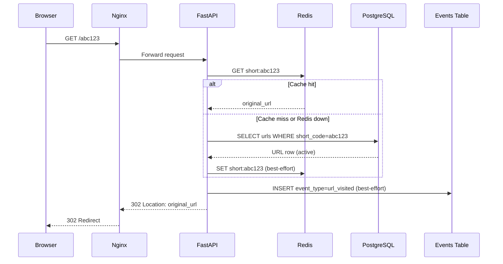
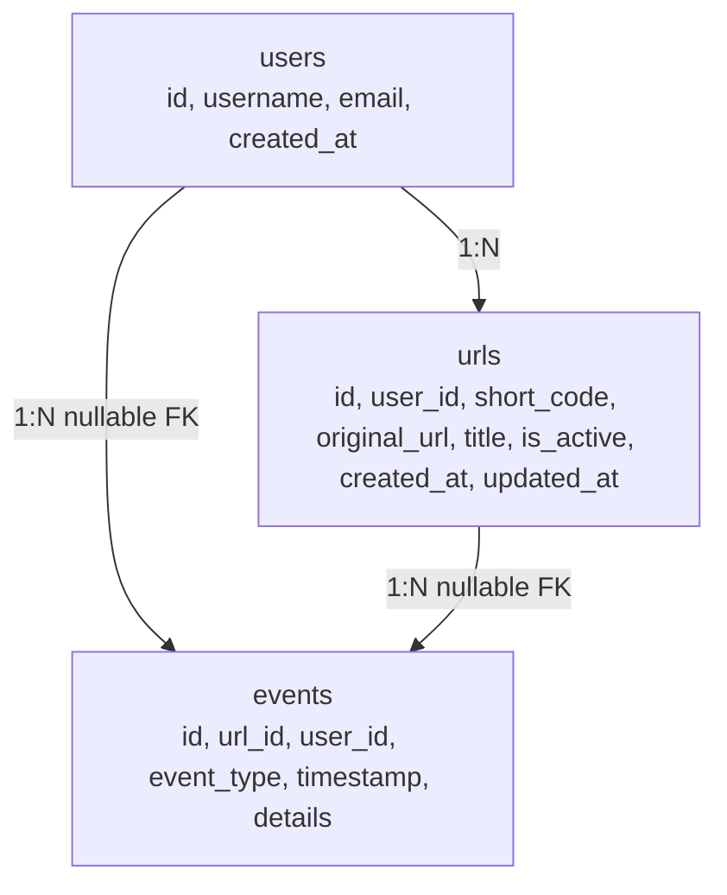

# Architecture
System design and runtime behavior for the production-engineering URL shortener stack.

## Redirect Sequence (Primary Read Path)



## Data Model



## ASCII Fallback Diagram

```text
+---------+      +-------+      +---------+
| Client  +----->+ Nginx +----->+ FastAPI |
+---------+      +-------+      +----+----+
                                  /   \
                                 /     \
                          +------+      +-----------+
                          | Redis|      | PostgreSQL|
                          +--+---+      +-----+-----+
                             |                |
                             |            +---v---+
                             +----------->+events +
                                          +-------+
```

## Docker Services

| Service | Image / Runtime | Responsibility |
|---|---|---|
| api | Python 3.13 + FastAPI | Core app logic, validation, redirect handling, event generation |
| postgres | postgres:16-alpine | Durable source of truth for users, URLs, events |
| redis | redis:7-alpine | Cache for short code to original URL lookups |
| nginx | nginx:1.27-alpine | Reverse proxy, health endpoint fan-in, traffic front door |

## Redis Caching Strategy

1. Attempt Redis read first for `short:{code}`.
2. On cache miss or Redis error, query PostgreSQL.
3. If URL is active, return 302 and backfill cache best-effort.
4. Cache writes are TTL-based via `REDIS_CACHE_TTL_SECONDS` (default 60).
5. Deactivation path deletes cache key to avoid stale redirects.

## Redis Chaos Resilience

When Redis is unavailable:

1. API continues serving redirects via PostgreSQL lookup.
2. Cache get/set operations are wrapped in exception-safe paths.
3. Short Redis socket/connect timeouts prevent request stalls.
4. `url_visited` event write remains best-effort and does not block redirects.
5. After Redis recovers, subsequent misses repopulate cache automatically.
