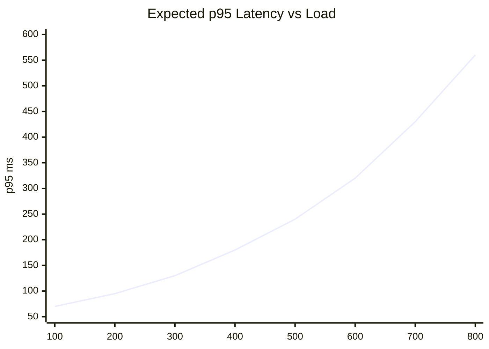

# Capacity Plan
Load assumptions, expected bottlenecks, and scaling path for the URL shortener platform.

## Scope and Assumptions
- Primary traffic is redirect-heavy (`GET /{short_code}`).
- Write traffic (`POST /users`, `POST /urls`, `PUT /urls/{id}`) is lower but non-trivial.
- Seed dataset baseline is roughly 398 users, 1,992 URLs, 3,409 events.
- Local baseline deployment is single API process behind Nginx with one Postgres and one Redis instance.

## Latency Targets

| Endpoint Class | p50 Target | p95 Target | Notes |
|---|---:|---:|---|
| Redirect cache hit | <= 25 ms | <= 80 ms | Nginx + API + Redis read |
| Redirect DB fallback | <= 90 ms | <= 250 ms | Includes DB query and event write best-effort |
| User/URL reads | <= 80 ms | <= 220 ms | Query complexity low with current indexes |
| User/URL writes | <= 120 ms | <= 350 ms | Includes commit and optional event insert |

## Throughput Expectations (Single-Node Baseline)

| Traffic Pattern | Expected Stable RPS | Stress Threshold | Breaking Point Symptoms |
|---|---:|---:|---|
| Redirect-heavy, warm cache | 300-600 | 800+ | Rising p95, Redis saturation, API queueing |
| Redirect-heavy, Redis unavailable | 120-250 | 350+ | Postgres CPU/IO rise, request timeout risk |
| Mixed CRUD + redirect | 100-220 | 300+ | DB lock/contention increases, write latency spikes |

These are planning estimates for hackathon infrastructure, not formal benchmark-certified values.

## Bottleneck Analysis

### 1. Postgres under Redis outage
- Why: Every redirect falls through to SQL lookup.
- Impact: p95 and error rates increase fastest in this mode.
- Mitigation:
  - Keep Redis timeouts low for quick fallback decision.
  - Ensure index health on `urls.short_code`.
  - Consider read-replica strategy for scale-up.

### 2. API worker concurrency limits
- Why: Single container with finite worker/event loop capacity.
- Impact: Queueing delay under burst traffic.
- Mitigation:
  - Horizontal scale API instances.
  - Tune worker count and connection pool.

### 3. Event table growth
- Why: Redirect and CRUD paths append events continuously.
- Impact: Larger event scans and slower analytics queries over time.
- Mitigation:
  - Add retention policy or archive strategy.
  - Add composite indexes for common filters if needed.

## Capacity Trend (Conceptual)

## Scaling Roadmap

### Stage 1: Tune Current Single Stack
- Keep Redis timeout/connect timeout low.
- Confirm all required indexes exist and are used.
- Increase DB pool size conservatively.

### Stage 2: Horizontal API Scale
- Run multiple API replicas behind Nginx/load balancer.
- Keep API containers stateless.
- Monitor per-instance p95 and saturation.

### Stage 3: Data Layer Scale
- Introduce Postgres read replica for read-dominant paths.
- Evaluate Redis high-availability deployment.
- Introduce event archival/partitioning.

## Resource Planning Estimates

| Service | Dev/Small | Medium | High |
|---|---|---|---|
| API | 1 vCPU, 512 MB | 2 vCPU, 1 GB | 4 vCPU, 2+ GB |
| Postgres | 1 vCPU, 1 GB | 2 vCPU, 2 GB | 4+ vCPU, 4+ GB |
| Redis | 0.5 vCPU, 256 MB | 1 vCPU, 512 MB | 2 vCPU, 1+ GB |
| Nginx | 0.5 vCPU, 256 MB | 1 vCPU, 512 MB | 1-2 vCPU, 1 GB |

## Monitoring Signals to Track
- HTTP p50/p95/p99 for redirect and CRUD endpoints.
- API 5xx rate and timeout rate.
- Redis availability and command latency.
- Postgres CPU, active connections, slow query count.
- Container restarts and healthcheck failures.
